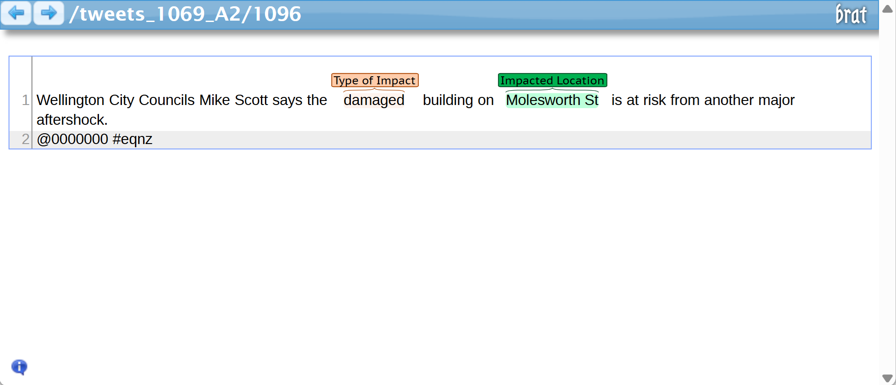

# DILC-Disaster Impact Location Corpus

This repository contains annotated data from 19 major
natural disasters spanning 11 countries, covering both native and non-native English speaking regions from social media (X/tweet). Data is annotated with two types of entities, impacts (e.g., casualties, injuries, infrastructure/utility damage) and their corresponding impacted locations. The dataset is designed to support research in disaster response, georeferencing, and the development of machine learning/LLM models for location-aware impact assessment.

  
   
  <em>Example of a tweet annotated for impacted location and impact type.</em>

